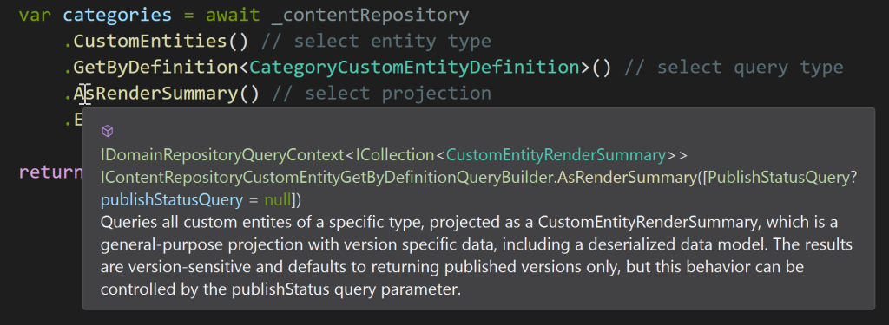

## IContentRepository

The recommended way to access Cofoundry data is by using one of our repository abstractions, which offer an easily discoverable fluent API enriched with inline documentation to help you choose the most suitable query or command for you needs. 

We'd recommend getting started with `IContentRepository`, which should be injected into your class using dependency injection:

```csharp
using Cofoundry.Domain;

public class ExampleController : Controller
{
    private readonly IContentRepository _contentRepository;

    public ExampleController(
        IContentRepository contentRepository
        )
    {
        _contentRepository = contentRepository;
    }

    [Route("/api/categories-example")]
    public async Task<IActionResult> Categories()
    {
        var categories = await _contentRepository
            .CustomEntities() // select entity type
            .GetByDefinition<CategoryCustomEntityDefinition>() // select query type
            .AsRenderSummaries() // select projection
            .ExecuteAsync(); // execute

        return Json(categories);
    }
}
```

In this example we're using an MVC controller, but this will work anywhere that supports dependency injection. Note that XML comments are provided to help guide you towards the most suitable query or projection.



This fluent style of querying might look a little like the flexible querying used in Linq or Entity Framework, but this is different. Cofoundry data access is based around strongly typed queries and commands, and here we are actually just building a strongly typed query object and executing it.

While this approach isn't as flexible as a dynamic query builder framework like Entity Framework, it does allow us to provide a strong contract for what parameters we expect and what result you receive. This in turn enable us to hide the complexities of the underlying storage structure, provide more reliable performance, be more explicit about what we support and more easily communicate breaking changes.

### Mapping

A mapping function can be chained using a call to `Map`. If the result type is nullable you can use `MapWhenNotNull` to skip mapping when the result is null and avoid hanlding it in your mapping code. Note that mapping functions are invoked after query execution, so this is really just a neater way of writing queries with mapped results.

```csharp
var entity = await _contentRepository
    .CustomEntities()
    .GetById(1)
    .AsRenderSummary()
    .MapWhenNotNull(e => new
    {
        e.CustomEntityId,
        e.Title
    })
    .ExecuteAsync();
```

Items in collections and dictionaries can also be mapped with a call to `MapItem`, and `Map` can also be used to alter the collection. For dictionaries results, `FilterAndOrderByKeys` can be used to set the ordering of the results to match an existing key set:

```csharp
var ids = new int[] { 3, 1, 6 };
var entities = await _contentRepository
    .CustomEntities()
    .GetByIdRange(ids)
    .AsRenderSummaries()
    .MapItem(i => new { i.UrlSlug, i.Title })
    .FilterAndOrderByKeys(ids)
    .Map(r => r.Reverse())
    .ExecuteAsync();
```

## IAdvancedContentRepository

`IAdvancedContentRepository` includes everything that can be found in `IContentRepository`, but also includes additional queries and commands that are not needed by most sites.

```csharp
await _advancedContentRepository
    .PageDirectories()
    .AddAsync(new()
    {
        Name = "Products",
        UrlPath = "products",
        ParentPageDirectoryId = 1
    });
```

## Influencing execution with ModelState

The `Cofoundry.Web` namespace includes extensions that make it easier to work with queries or command execution in ASP.NET controllers and Razor Pages by making use of `ModelState` to work with validation errors:

- Using `WithModelState(Controller|PageModel)` in the call chain wraps query and command execution with error handling code that pushes validation exceptions and error results into model state. Additionally if the model state is invalid prior to execution, then execution will be skipped.
- If using transactions, `scope.CompleteIfValidAsync(ModelState)` can be used to conditionally complete the transaction if the model state is valid.

#### Query Example

In this ASP.NET MVC example, executing `AuthenticateCredentials` returns a model derived from `ValidationQueryResult`, `WithModelState` will detect this result and automatically add any validation errors to the model state:

```csharp
using Cofoundry.Domain;
using Cofoundry.Web;

public class ExampleController : Controller
{
    // …constructor (omitted)

    [HttpPost("sign-in")]
    public async Task<IActionResult> SignIn(SignInViewModel viewModel)
    {
        // Wrap the query execution in WithModelState(this)
        var authResult = await _advancedContentRepository
            .WithModelState(this)
            .Users()
            .Authentication()
            .AuthenticateCredentials(new()
            {
                UserAreaCode = CustomerUserArea.Code,
                Username = viewModel.Username,
                Password = viewModel.Password
            })
            .ExecuteAsync();

        if (!ModelState.IsValid)
        {
            // If the result isn't successful, the the ModelState will be populated
            // with the error
            return View(viewModel);
        }

        // …sign in and redirect (omitted)
    }
}
```

### Command example

In this ASP.NET API controller example, `WithModelState` is used to wrap command execution, reducing the boilerplate for handling errors. Additionally, `scope.CompleteIfValidAsync(ModelState)` is used to conditionally complete the transaction:

```csharp
using Cofoundry.Domain;
using Cofoundry.Web;

[Route("api/members")]
[ApiController]
public class MembersApiController : ControllerBase
{
    // …constructor (omitted)

    [HttpPost("register")]
    public async Task<IActionResult> Register(RegisterUserDto registerUserDto)
    {
        using (var scope = _advancedContentRepository.Transactions().CreateScope())
        {
            // If there are any model validation errors, execution is skipped
            // If any validation exceptions occur during execution they are added to model state
            var userId = await _advancedContentRepository
                .WithModelState(this)
                .WithElevatedPermissions()
                .Users()
                .AddAsync(new()
                {
                    UserAreaCode = CustomerUserArea.Code,
                    RoleCode = CustomerRole.Code,
                    Email = registerUserDto.Email,
                    Password = registerUserDto.Password,
                });

            // If ModelState is not valid, then execution is skipped
            // If any validation exceptions occur during execution they are added to model state
            await _advancedContentRepository
                .Users()
                .AccountVerification()
                .EmailFlow()
                .InitiateAsync(new()
                {
                    UserId = userId
                });

            // The scope is only completed if the ModelState is valid
            await scope.CompleteIfValidAsync(ModelState);
        }

        // ModelState can be used to determine success
        if (ModelState.IsValid)
        {
            return Ok();
        }
        else
        {
            return BadRequest(ModelState);
        }
    }
}
```

## Further Reading

Both content repositories inherit from `IDomainRepository`. This base interface includes a number of other features including:

- [Query & command execution](/framework/data-access/idomainrepository#executing-queries-and-commands)
- [Permissions elevation](/framework/data-access/idomainrepository#elevating-permissions)
- [Changing execution context](/framework/data-access/idomainrepository#changing-context)
- [Transaction management](/framework/data-access/idomainrepository#transactions)

Read more about these features in the [IDomainRepository docs](/framework/data-access/idomainrepository)