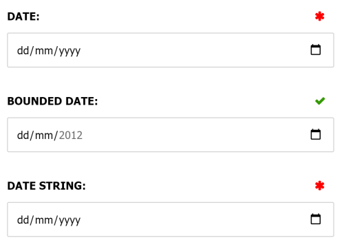
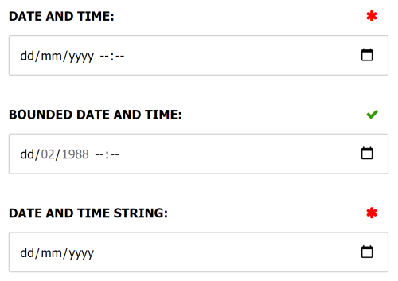
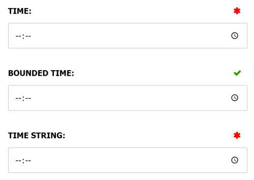

There are several different data annotations available for representing dates and times:

- [`[Date]`](#date)
- [`[DateLocal]`](#datelocal)
- [`[DateAndTime]`](#dateandtime)
- [`[DateAndTimeLocal]`](#dateandtimelocal)
- [`[Time]`](#time)

Each of these are explained below:

## [Date]

The `[Date]` data annotation can be used to decorate a `DateTime`, `DateTimeOffset` or `string` property and provide a UI hint to the admin interface to display a date picker field. The UI picker and value is timezone insensitive i.e. UTC, with the time value always set to midnight UTC. For a timezone-sensitive value use [`[DateLocal]`](datelocal).
    
A nullable `DateTime` or `DateTimeOffset` property type indicates the property is optional, whilst `string` properties are optional by default and the `[Required]` should be used to mark them as required.

#### Optional parameters

- **Min:** The inclusive minimum date allowed to be entered. The value must be in "yyyy-mm-dd" format. 
- **Max:** The inclusive maximum date allowed to be entered. The value must be in "yyyy-mm-dd" format.

#### Example

```csharp
public class ExampleDataModel : ICustomEntityDataModel
{
    /// <summary>
    /// Renders a required date field.
    /// </summary>
    [Date]
    public DateTime Date { get; set; }

    /// <summary>
    /// Renders an optional date field restricted to a 
    /// specific  date range.
    /// </summary>
    [Date(Min = "2012-07-27", Max = "2012-08-12")]
    public DateTimeOffset? BoundedDate { get; set; }

    /// <summary>
    /// Renders a required date field for a string property.
    /// </summary>
    [Date]
    [Required]
    public string DateString { get; set; } = string.Empty;
}
```

Output:



## [DateLocal]

The `[DateLocal]` data annotation is similar to the `[Date]` data annotation, except the UI picker captures the date at the web browsers timezone offset.

The time is always set to midnight in the web browser timezone, however the value is converted to UTC when saving the value.  

For a timezone-insensitive picker use [`[Date]`](#date).

## [DateAndTime]

The `[DateAndTime]` data annotation can be used to decorate a `DateTime`, `DateTimeOffset` or `string` property and provide a UI hint to the admin interface to display a date and time input field. The UI picker and value is timezone insensitive i.e. UTC. 

For a timezone-sensitive value use [`[DateAndTimeLocal]`](#dateandtimelocal).
    
A nullable `DateTime` or `DateTimeOffset` property type indicates the property is optional, whilst `string` properties are optional by default and the `[Required]` should be used to mark them as required.

#### Optional parameters

- **Min:** The inclusive minimum date and time allowed to be entered. The value must be in "yyyy-mm-ddThh:mm" format.
- **Max:** The inclusive maximum date and time allowed to be entered. The value must be in "yyyy-mm-ddThh:mm" format.
- **Step** Maps to the "step" html attribute, and is the number of seconds to increment the input by. The browser default is 1 minute (60 seconds) and will not allow seconds to be input. If this value is set to less  then 60 seconds, then seconds will be shown in the editor i.e. to make seconds editable, set this value to 1.

#### Example

```csharp
public class ExampleDataModel : ICustomEntityDataModel
{
    /// <summary>
    /// Renders a required date and time field.
    /// </summary>
    [DateAndTime]
    public DateTime DateAndTime { get; set; }

    /// <summary>
    /// Renders an optional date and time field restricted to a 
    /// specific  date range.
    /// </summary>
    [DateAndTime(Min = "1988-02-13T09:00", Max = "1988-02-28T19:00")]
    public DateTimeOffset? BoundedDateAndTime { get; set; }

    /// <summary>
    /// Renders a required date and time field for a string property.
    /// </summary>
    [Date]
    [Required]
    public string DateAndTimeString { get; set; } = string.Empty;
}
```

Output:



## [DateAndTimeLocal]

The `[DateAndTimeLocal]` data annotation is similar to the `[DateAndTime]` data annotation, except the UI picker captures the date and time at the web browsers timezone offset. The value is converted to UTC when saving the value.

If using the `Min` and `Max` validation parameters, the values should be in UTC, the UI will automatically convert these values to the users timezone.

For a timezone-insensitive picker use [`[DateAndTime]`](#dateandtime).

## [Time]

The `[Time]` data annotation can be used to decorate a `TimeSpan` or `string` property and provide a UI hint to the admin interface to display a time input field. By default the editor will show hours and minutes, but you can allow editing of seconds by setting the `Step` property to 1.

A nullable `TimeSpan` property type indicates the property is optional, whilst `string` properties are optional by default and the `[Required]` should be used to mark them as required.

#### Optional parameters

- **Min:** The inclusive minimum time allowed to be entered. The value must be in "hh:mm" or "hh:mm:ss" format.
- **Max:** The inclusive maximum time allowed to be entered. The value must be in "hh:mm" or "hh:mm:ss" format.
- **Step** Maps to the "step" html attribute, and is the number of seconds to increment the input by. The browser default is 1 minute (60 seconds) and will not allow seconds to be input. If this value is set to less then 60 seconds, then seconds will be shown in the editor i.e. to make seconds editable, set this value to 1.

#### Example

```csharp
public class ExampleDataModel : ICustomEntityDataModel
{
    /// <summary>
    /// Renders a required time field that allows seconds to be input.
    /// </summary>
    [Time]
    public TimeSpan Time { get; set; }

    /// <summary>
    /// Renders an optional time field restricted to a 
    /// specific  date range.
    /// </summary>
    [Time(Min = "09:00", Max = "17:30")]
    public TimeSpan? BoundedTime { get; set; }

    /// <summary>
    /// Renders a required time field for a string property.
    /// </summary>
    [Time]
    [Required]
    public string TimeString { get; set; } = string.Empty;
}
```

Output:


