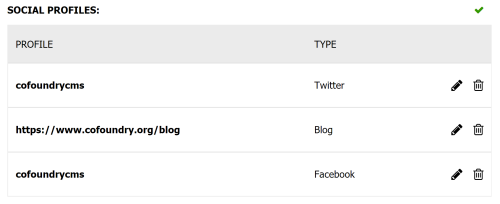

Nested data models allow you to define a model that can be used as child property of another data model. 

This is useful for creating rich data structures for your block types and custom entities, and enables the creation of more complex components such as multi-layered menus, advanced carousels and other nested content scenarios.

There are two types of nested data model annotations:

- [`[NestedDataModelCollection]`](#nesteddatamodelcollection)
- [`[NestedDataModelMultiTypeCollection]`](#nesteddatamodelmultitypecollection)

Each of these annotations are explained further down the page, but first we need to understand how to define a nested data model.

## Defining a Nested Data Model

A nested data model is simply a class that inherits from `INestedDataModel`. You can add any properties you like and annotate them in the same way you would with any other data model. You can even recursively reference the same nested data model inside itself, which can be useful for building hierarchical data structures such as menus.

The following example represents one slide in a carousel:

```csharp
using System.ComponentModel.DataAnnotations;
using Cofoundry.Domain;

public class CarouselSlideDataModel : INestedDataModel
{
    [PreviewImage]
    [Display(Description = "Image to display as the background tot he slide.")]
    [Required]
    [Image]
    public int ImageId { get; set; }

    [PreviewTitle]
    [Required]
    [Display(Description = "Title to display in the slide.")]
    [MaxLength(100)]
    public string Title { get; set; } = string.Empty;

    [Display(Description = "Formatted text to display in the slide.")]
    [Required]
    [Html(HtmlToolbarPreset.BasicFormatting)]
    public string Text { get; set; } = string.Empty;
}
```

Note that the [display preview](Display-Preview) set of attributes can be used to control which properties display as columns in a selection grid.

The next section shows you how you can use this data model to create the data model for a carousel. 

## [NestedDataModelCollection]

The `[NestedDataModelCollection]` attribute is used to mark a property that contains a collection of nested data model types.

#### Optional Properties

- **MinItems:** The minimum number of items that need to be included in the collection. 0 indicates no minimum.
- **MaxItems:** The maximum number of items that can be included in the collection. 0 indicates no maximum.
- **IsOrderable:** Set to true to allow the collection ordering to be set by an editor using a drag and drop interface. Defaults to false.

#### Example

This example uses the `CarouselSlideDataModel` defined in the last section.

```csharp
using System.ComponentModel.DataAnnotations;
using Cofoundry.Domain;

public class CarouselDataModel : IPageBlockTypeDataModel, IPageBlockTypeDisplayModel
{
    [MaxLength(100)]
    [Required]
    public string Title { get; set; } = string.Empty;

    [Required]
    [NestedDataModelCollection(IsOrderable = true, MinItems = 2, MaxItems = 6)]
    public CarouselSlideDataModel[] Items { get; set; } = [];
}
```


## [NestedDataModelMultiTypeCollection]

The `[NestedDataModelMultiTypeCollection]` data annotation can be used to decorate a collection of `NestedDataModelMultiTypeItem` objects, indicating the property represents a set of nested data models of mixed types. The types must be defined in the attribute constructor by passing in a type reference for each nested data model you want to be able to add.

#### Optional Properties

- **MinItems:** The minimum number of items that need to be included in the collection. 0 indicates no minimum.
- **MaxItems:** The maximum number of items that can be included in the collection. 0 indicates no maximum.
- **IsOrderable:** Set to true to allow the collection ordering to be set by an editor using a drag and drop interface. Defaults to false.
- **TitleColumnHeader:** The text to use in the column header for the title field. Defaults to "Title".
- **DescriptionColumnHeader:** The text to use in the column header for the description field. Defaults to "Description".
- **ImageColumnHeader:** The text to use in the column header for the image field. Defaults to empty string.
- **TypeColumnHeader:** The text to use in the column header for the model type field. Defaults to "Type".

#### Example

The following example shows a property that links to different types of social media profiles. 

```csharp
using Cofoundry.Domain;

public class ExampleDataModel : ICustomEntityDataModel
{
    [NestedDataModelMultiTypeCollection(
        [
            typeof(FacebookProfileDataModel),
            typeof(TwitterProfileDataModel),
            typeof(LinkedInProfileDataModel),
            typeof(BlogLinkDataModel)
        ],
        IsOrderable = true,
        MinItems = 1,
        MaxItems = 3,
        TitleColumnHeader = "Profile"
        )]
    public NestedDataModelMultiTypeItem[] SocialProfiles { get; set; } = [];
}
```

Output:



The nested data models referenced in the example are shown below:

```csharp
using Cofoundry.Domain;

[Display(Name = "Facebook")]
public class FacebookProfileDataModel : INestedDataModel
{
    [Display(Name = "Facebook Id")]
    [PreviewTitle]
    [Required]
    public string FacebookId { get; set; } = string.Empty;
}

[Display(Name = "Twitter")]
public class TwitterProfileDataModel : INestedDataModel
{
    [PreviewTitle]
    [Required]
    public string TwitterHandle { get; set; } = string.Empty;
}

[Display(Name = "LinkedIn")]
public class LinkedInProfileDataModel : INestedDataModel
{
    [Display(Name = "Profile Id")]
    [PreviewTitle]
    [Required]
    public string ProfileId { get; set; } = string.Empty;
}

[Display(Name = "Blog")]
public class BlogLinkDataModel : INestedDataModel
{
    [PreviewTitle]
    [Url]
    [Required]
    public string Url { get; set; } = string.Empty;
}
```

## Further Examples

You can find a full walk through of nested data models on [our blog](https://www.cofoundry.org/blog/14/introducing-nested-data-models), and more examples in our [Menus](https://github.com/cofoundry-cms/Cofoundry.Samples.Menus) and [Page Block Types](https://github.com/cofoundry-cms/Cofoundry.Samples.PageBlockTypes) samples projects.