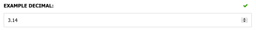
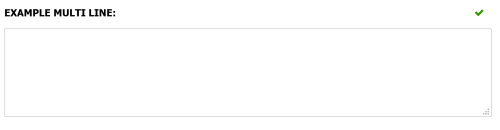

Primitive and basic types such as `string` and `int` display using a default editor that corresponds with their type. The default editor can be overridden by adding data annotations.

Supported primitive types include:

- `bool`: Displays as a checkbox
- `char`: Displays as a single-character text input
- `string`: Displays as a text input
- `byte`, `sbyte`, `short`, `ushort`, `int`, `uint`, `long`, `ulong`: Displays as an integer number input
- `float`, `double`, `decimal`: Displays as a numerical input

The following data annotations can be used to enhance the standard editors:

- [`[Number]`](#number)
- [`[MultiLineText]`](#multilinetext)

Each of these are explained below:

## [Number]

The `[Number]` data annotation can be used to decorate a numeric field (e.g. int, decimal, long) and provide a UI hint to the admin interface to display an html5 number field. 

The step property can be used to specify the precision of the number e.g. 2 decimal places

A nullable numeric type indicates it is an optional field, while a non-null numeric type indicates it is a required field. 

#### Optional parameters

- **Step:** Maps to the [step attribute](https://developer.mozilla.org/en-US/docs/Web/HTML/Attributes/step) on a number html input field. This can be used to control the precision of the number entered. E.g. use a step value of '0.1' to allow a decimal value to 1 decimal place. The default value is '1' which uses integer level precision. A special value of 'any' can be used to allow any number type.

#### Example

```csharp
public class ExampleDataModel : ICustomEntityDataModel
{
    /// <summary>
    /// Renders a numeric input to two decimal places. As the decimal
    /// type is nullable, this is an optional field.
    /// </summary>
    [Number(Step = "0.01")]
    public decimal? ExampleDecimal { get; set; }
}
```

Output:



## [MultiLineText]

The `[MultiLineText]` data annotation can be used to decorate a `string` property and provide a UI hint to the admin interface to display a [textarea](https://developer.mozilla.org/en-US/docs/Web/HTML/Element/textarea) field.

#### Optional parameters

- **Rows:** The number of visible lines of text in the text editor. Defaults to 4.

#### Example

```csharp
public class ExampleDataModel : ICustomEntityDataModel
{
    [MultiLineText(Rows = 8)]
    public string? ExampleMultiLine { get; set; }
}
```

Output:

