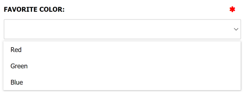
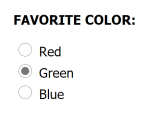
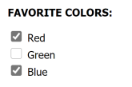

There are three data annotations for rendering list-style elements:

- [`[SelectList]`](#selectlist): A drop-down list of options.
- [`[RadioList]`](#radiolist): A list of radio buttons that allows only a single option to be selected.
- [`[CheckboxList]`](#checkboxlist): A list of checkbox options that allows multiple options to be selected.

Options can be provided in three different ways:

- [`Enum`](#enum): Use an enum type to derive the options from enum values.
- [`IListOptionSource`](#ilistoptionsource): Define a class that generates option values at runtime.
- [`IListOptionApiSource`](#ilistoptionapisource): Define a class that tells Cofoundry how to extract options from an API or static file.

Each of these are explained below:

## List-style Annotations

### [SelectList]



The `[SelectList]` data annotation can be used to decorate a collection attribute to indicate it should be rendered as a select list (drop down list) in the admin UI. 

The property should use the same type as the associated option values. For value types, a nullable type can be used to indicate the field is optional. For reference types like `string` the field will be optional by default, but you can use the `[required]` attribute to force a value to be selected.

An "*option source* type should be provided in the constructor, this is used to determine the options available for the property. See [Option Sources](#list-option-sources) for more details.
    
#### Optional parameters

- **DefaultItemText:** The text to display when the value is not set or has not been selected yet.

#### Example

This example uses an `Enum` option source:

```csharp
using Cofoundry.Domain;

public enum ColorOption
{
    Red,
    Green,
    Blue
}

public class ExampleDataModel : ICustomEntityDataModel
{
    [SelectList(typeof(ColorOption))]
    public ColorOption FavoriteColor { get; set; }
}
```

### [RadioList]



The `[RadioList]` data annotation can be used to decorate a collection attribute to indicate it should be rendered as a list of radio buttons in the admin UI.

The property should use the same type as the associated option values. For value types, a nullable type can be used to indicate the field is optional. For reference types like `string` the field will be optional by default, but you can use the `[required]` attribute to force a value to be selected.

An *option source* type should be provided in the constructor, this is used to determine the options available for the property. See [Option Sources](#list-option-sources) for more details.
    
#### Optional parameters

- **DefaultItemText:** The text to display when the value is not set or has not been selected yet.

#### Example

This example uses an `Enum` option source:

```csharp
using Cofoundry.Domain;

public enum ColorOption
{
    Red,
    Green,
    Blue
}

public class ExampleDataModel : ICustomEntityDataModel
{
    [RadioList(typeof(ColorOption))]
    public ColorOption FavoriteColor { get; set; }
}
```

### [CheckboxList]



The `[CheckboxList]` data annotation can be used to decorate a collection attribute to indicate it should be rendered as a list of checkboxes in the admin UI. 

A checkbox list allows multiple values to be selected and so the property type should be a collection, and the collection type should use the same type as the associated option values.

The `[Required]` attribute can be used to ensure that at least one item is selected in the list.

An *option source* type should be provided in the constructor, this is used to determine the options available for the property. See [Option Sources](#list-option-sources) for more details.
    
#### Optional parameters

- **NoValueText:** The text to show in non-edit mode when no value is selected.

#### Example

This example uses an `Enum` option source:

```csharp
using Cofoundry.Domain;
using System.Collections.Generic;

public enum ColorOption
{
    Red,
    Green,
    Blue
}

public class ExampleDataModel : ICustomEntityDataModel
{
    [CheckboxList(typeof(ColorOption))]
    public ColorOption[] FavoriteColors { get; set; } = [];
}
```

## List Option Sources

### Enum

The simplest way to define a list of values is to use an `Enum` type. The names of the enum values will be used in the list, presented in the order that they are defined.

Each enum name is converted to *sentence case* before rendering e.g. "ExampleValue" becomes "Example value". 

Each of the examples in the previous section uses an `Enum` source.

### IListOptionSource

Use an `IListOptionSource` to define ta static list of option, text and values you want in your selection list. 

Simply implement the interface and pass the type into the list attribute constructor.

Note that your `IListOptionSource` does not support DI.

#### Example

```csharp
using Cofoundry.Domain;
using System.Collections.Generic;

public class ExampleListOptionSource : IListOptionSource
{
    public IReadOnlyCollection<ListOption> Create()
    {
        var options = new ListOption[]
        {
            new("Negative", 1),
            new("Neutral", 2),
            new("Positive", 3)
        };

        return options;
    }
}

public class ExampleDataModel : ICustomEntityDataModel
{
    [RadioList(typeof(ExampleListOptionSource), DefaultItemText = "Not Specified")]
    public int? Feedback { get; set; }
}
```

### IListOptionApiSource

Using an API source gives you the flexibility of generating your list options from a dynamic data source such as a database.

#### Creating an API

You'll first need to create your API endpoint. The response will need to conform the following constraints:

- The data should an array of models. `Object` is used in the example below for simplicity.
- The data can be at the root of the JSON document, or can be nested in a `data` property (lower case).

In the example below we inherit from `BaseAdminApiController` to ensure that the API is only permitted to be accessed by users signed into the Cofoundry admin panel.

```csharp
using Microsoft.AspNetCore.Mvc;
using Cofoundry.Web.Admin;

[Route("admin/api/pets")]
[ApiController]
public class PetsApiController : BaseAdminApiController
{
    public ActionResult<object[]> Get()
    {
        var result = new object[]
        {
            new { Id = 1, Title = "Dog" },
            new { Id = 2, Title = "Cat" },
            new { Id = 3, Title = "Fish" },
            new { Id = 4, Title = "Stick Insect" }
        };

        return result;
    }
}
```

This example API returns this response:

```json
[
    {
        "id": 1,
        "title": "Dog"
    },
    {
        "id": 2,
        "title": "Cat"
    },
    {
        "id": 3,
        "title": "Fish"
    },
    {
        "id": 4,
        "title": "Stick Insect"
    }
]
```

#### Linking your API using IListOptionApiSource

Inherit from `IListOptionApiSource` to describe your API by implementing these properties:

- **Path:** The path the to the list option API. This should be relative e.g. /admin/api/example-options
- **NameField:** The field in the response object to display in the option.
- **ValueField:** The field in the response object to use as the option value.

#### Example

```csharp
using Cofoundry.Domain;
using System.Collections.Generic;

public class PetsApiOptionSource : IListOptionApiSource
{
    public string Path => "/admin/api/pets";

    public string NameField => "Title";

    public string ValueField => "Id";
}

public class ExampleDataModel : ICustomEntityDataModel
{
    [CheckboxList(typeof(PetsApiOptionSource))]
    public int[] PetIds { get; set; } = [];
}
```