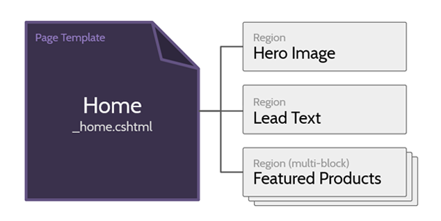

Cofoundry has content management features that let you create and manage your website pages dynamically using templates. Multiple pages can be created from a single template, and each template can have multiple regions of modular content that makes content editing flexible yet manageable.

## Page Templates Files



A page template is a normal razor cshtml file that accepts an `IPageViewModel` model; you can use everything that you would normally use with a normal razor view file such as layout pages, partials and view components. The main difference is that in a template you can make use of `ICofoundryTemplateHelper<IPageViewModel>` to add some template specific features such as the ability to define regions.

#### Template Location

Templates can be located in one of two places:

- /Cofoundry/PageTemplates/
- /Views/PageTemplates/

This depends on whether you want to keep Cofoundry content in it's own folder or use the standard View folder convention.

#### File Naming

There's no file naming convention so it's up to you, however the display name of the template is taken from the file name though so keep that in mind. When creating the display name the leading underscore is removed and the name is humanized using `TextFormatter.PascalCaseToSentence()`.

#### Injecting ICofoundryTemplateHelper

`ICofoundryTemplateHelper<TModel>` is an enhanced version of the [Cofoundry view helper](Cofoundry-View-Helper) and is injected at the top of your view in the same way you would inject any service. When injecting the helper we recommend aliasing it as `Cofoundry`.

**ExampleTemplate.cshtml**
```html
@using Cofoundry.Web
@using Cofoundry.Domain

@model IPageViewModel
@inject ICofoundryTemplateHelper<IPageViewModel> Cofoundry

<div class="container">

    <h1>@Model.PageTitle</h1>

    @(await Cofoundry.Template.Region("Body")
        .AllowMultipleBlocks()
        .InvokeAsync())

</div>

```

## Creating a Region

Each template can have multiple **Regions**, which define areas where dynamic content can be added. Each region can contain 0 or more blocks, these are essentially customizable pieces of content that could be as simple as a single line of text or more complicated like an image gallery. Here's a simple example of a region definition:

```html
<div>
    @await Cofoundry.Template.Region("Body").InvokeAsync()
</div>
```

This will define a region named *Body* that:

- Can have 0 or 1 content block
- Has no restrictions on which block types can be added
 
Additional options can be added using the fluent region builder. Here's a more complex example:

```html
<div>
    @(await Cofoundry.Template.Region("LeadText")
        .AllowMultipleBlocks()
        .AllowBlockType<PlainTextDataModel>()
        .AllowBlockType<RichTextDataModel>()
        .InvokeAsync())
</div>
```
This will define a region named *Lead Text* that:

- Can have an unlimited number of content blocks added
- Can only use the *Plain Text* and *Rich Text* block types

#### Page Block Types

There are a handful of block types included by default, but it's also easy to create your own, it requires only a poco data model and a razor view file. For more information see the [Page Block Types](Page-Block-Types) documentation.

## Initializing the Template

Templates are added and updated on startup, which will run once your application has been deployed. To trigger this process in development you'll need to restart your debugging session.

## Customizing the IPageViewModel implementation

Sometimes you may want to customize the model sent to page templates. There's two ways to this depending on how much control you want over the model instantiation.

#### IPageViewModelFactory

Override the default `IPageViewModelFactory` implementation to provide custom base class types for dynamic pages. For guidance on overriding an implementation using the DI system, see the [dependency injection docs](/framework/dependency-injection#overriding-registrations)

```csharp
using Cofoundry.Domain;
using Cofoundry.Web;

public class ExamplePageViewModelFactory : IPageViewModelFactory
{
    public IPageViewModel CreatePageViewModel()
    {
        return new ExamplePageViewModel();
    }
    
    public ICustomEntityPageViewModel<TDisplayModel> CreateCustomEntityPageViewModel<TDisplayModel>() where TDisplayModel : ICustomEntityPageDisplayModel
    {
        return new ExampleCustomEntityPageViewModel<TDisplayModel>();
    }

    public INotFoundPageViewModel CreateNotFoundPageViewModel()
    {
        return new ExampleNotFoundPageViewModel();
    }

    public IErrorPageViewModel CreateErrorPageViewModel()
    {
        return new ExampleErrorPageViewModel();
    }
}
```

#### IPageViewModelBuilder

Override the default `IPageViewModelBuilder` if you need complete control over model creation or to fetch data asynchronously. For guidance on overriding an implementation using the DI system, see the [dependency injection docs](/framework/dependency-injection#overriding-registrations).

This example shows a complete implementation, but you can also inherit from `PageViewModelBuilder` if you only need to override part of the implementation.

```csharp
public class ExamplePageViewModelBuilder : IPageViewModelBuilder
{
    private readonly IPageViewModelFactory _pageViewModelFactory;
    private readonly IPageViewModelMapper _pageViewModelMapper;

    public ExamplePageViewModelBuilder(
        IPageViewModelFactory pageViewModelFactory,
        IPageViewModelMapper pageViewModelMapper
        )
    {
        // Constructor injection is supported
        // Here we make use of the same helpers used in the base class
        _pageViewModelFactory = pageViewModelFactory;
        _pageViewModelMapper = pageViewModelMapper;
    }

    public async Task<IPageViewModel> BuildPageViewModelAsync(PageViewModelBuilderParameters mappingParameters)
    {
        // Create the custom view model instance
        var viewModel = new ExamplePageViewModel();

        // Do the base mapping
        await _pageViewModelMapper.MapPageViewModelAsync(viewModel, mappingParameters);

        // TODO: insert your custom custom mapping

        return viewModel;
    }

    public async Task<ICustomEntityPageViewModel<TDisplayModel>> BuildCustomEntityPageViewModelAsync<TDisplayModel>(
        CustomEntityPageViewModelBuilderParameters mappingParameters
        ) where TDisplayModel : ICustomEntityPageDisplayModel
    {
        // Create the custom view model instance
        var viewModel = new ExampleCustomEntityPageViewModel<TDisplayModel>();

        // Do the base mapping
        await _pageViewModelMapper.MapCustomEntityViewModelAsync(viewModel, mappingParameters);

        // Example of calling an async custom mapping function
        await ExampleCustomMappingAsync(viewModel);

        return viewModel;
    }

    public async Task<INotFoundPageViewModel> BuildNotFoundPageViewModelAsync(NotFoundPageViewModelBuilderParameters mappingParameters)
    {
        // This example show using the default behaviour without any customization
        // You could alternatively inherit from PageViewModelBuilder and use the base implementation
        var viewModel = _pageViewModelFactory.CreateNotFoundPageViewModel();

        await _pageViewModelMapper.MapNotFoundPageViewModelAsync(viewModel, mappingParameters);

        return viewModel;
    }

    private static Task ExampleCustomMappingAsync<TDisplayModel>(ICustomEntityPageViewModel<TDisplayModel> model)
        where TDisplayModel : ICustomEntityPageDisplayModel
    {
        return Task.CompletedTask;
    }

    public async Task<IErrorPageViewModel> BuildErrorPageViewModelAsync(ErrorPageViewModelBuilderParameters mappingParameters)
    {
        // This example show using the default behaviour without any customization
        // You could alternatively inherit from PageViewModelBuilder and use the base implementation
        var viewModel = _pageViewModelFactory.CreateErrorPageViewModel();

        await _pageViewModelMapper.MapErrorPageViewModelAsync(viewModel, mappingParameters);

        return viewModel;
    }
}
```
