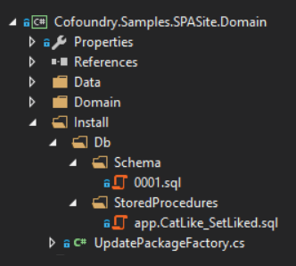

Cofoundry has an automatic update system that runs when the application is started. This mainly runs SQL scripts, but it can also run .net code too.

When adding your own custom objects it is advised that you take advantage of this framework to manipulate the database or make any other changes. This means that any changes are tracked in version control and can be automatically applied to any development or deployment environment.

## A Simple Example

Most of the time we use the auto-update framework for adding tables and other objects to a database. Since this is the most common and simplest scenario let's go through that first and use the [SPASite sample application](https://github.com/cofoundry-cms/Cofoundry.Samples.SPASite) for reference.

The convention is to put all our installation code into an 'Install' directory:



#### UpdatePackageFactory

The auto-update framework scans our application looking for implementations of `IUpdatePackageFactory`. These factories return a collection of `UpdatePackage` objects that tell the framework what needs to be run to update the system.

In this example we're only interested in running database updates so our UpdatePackageFactory class inherits from `BaseDbOnlyUpdatePackageFactory`

```csharp
using Cofoundry.Core;
using Cofoundry.Core.AutoUpdate;

public class UpdatePackageFactory : BaseDbOnlyUpdatePackageFactory
{
    /// <summary>
    /// The module identifier should be unique to this installation
    /// and usually indicates the application or plugin being updated
    /// </summary>
    public override string ModuleIdentifier => "SPASite";

    /// <summary>
    /// Here we can any modules that this installation is dependent
    /// on. In this case we are dependent on the Cofoundry installation
    /// being run before this one
    /// </summary>
    public override IReadOnlyCollection<string> DependentModules { get; } = [CofoundryModuleInfo.ModuleIdentifier];
}
```

Although not shown in the example above, we also have the option to override and customize the `ScriptPath` property which defaults to "Install/Db/".

#### SQL Scripts

Under default conventions your db scripts should be put into folders like so:

- Install
    - Db
        - Schema
        - Functions
        - Views
        - Triggers
        - StoredProcedures
        - Finalize

**Schema** files should be named as an integer version number and I'd usually add leading zeros to the name to make them order correctly in the file viewer, but that is an optional preference (e.g. 0001.sql, 0002.sql). The version of the update is dependent on the schema file name, so if there is no schema update script to be run then no other script files will be run.

**Functions, Views, Triggers and StoredProcedures** files should be named as the name of the object being created and *can* include the schema name e.g. 'dbo.Asset_GetAll.sql', 'log.Error_GetById'. For these object types the installation package will automatically drop the object if it exists before running the script. All these scripts will be re-run every time there is a version update. 

**Finalize** files has no special conventions and will always be run once all version updates have been applied.

#### Embedding Scripts

Any scripts you add must be marked as embedded files. To do this you can either change the *Build action* in the Visual Studio property window to *Embedded resource* for each file, or you can add an include rule to your project file directly to include all SQL files:

```xml
<ItemGroup>
    <EmbeddedResource Include="Install\**\*.sql" />
</ItemGroup>
```

#### Transactions & Failed Scripts

Each script runs inside a transaction, so if the script fails then any changes made while executing the script will be rolled back. The error is logged to the *Cofoundry.ModuleUpdateError* table and no more scripts are executed. Successful updates are logged to the *Cofoundry.ModuleUpdate* table.

## Advanced Installations

To do a more advanced installation you can implement `IUpdatePackageFactory` directly and choose what you want to include in the `UpdatePackage` yourself. 

The best example of a custom installation is for Cofoundry itself, which on top of database updates, has to run a number of non-database commands as well:

```csharp
using Cofoundry.Core.AutoUpdate;
using Cofoundry.Core;

public class CofoundryUpdatePackageFactory : IUpdatePackageFactory
{
    /// <summary>
    /// Typically you'd only ever return one UpdatePackage here, but
    /// multiple are supported.
    /// </summary>
    public IEnumerable<UpdatePackage> Create(IReadOnlyCollection<ModuleVersion> versionHistory)
    {
        var moduleVersion = versionHistory.SingleOrDefault(m => m.Module == CofoundryModuleInfo.ModuleIdentifier);

        // The DbUpdateCommandFactory is used to get database updates using the standard conventions
        var dbCommandFactory = new DbUpdateCommandFactory();

        var commands = new List<IVersionedUpdateCommand>();
        commands.AddRange(dbCommandFactory.Create(GetType().Assembly, moduleVersion));
        commands.AddRange(GetAdditionalCommands(moduleVersion));

        var package = new UpdatePackage()
        {
            ModuleIdentifier = CofoundryModuleInfo.ModuleIdentifier,
            AlwaysUpdateCommands = GetAlwaysUpdateCommand().ToArray(),
            VersionedCommands = commands
        };

        yield return package;
    }

    /// <summary>
    /// These commands are run every time the application updates, 
    /// and are run after all other commands have been run
    /// </summary>
    private IEnumerable<IAlwaysRunUpdateCommand> GetAlwaysUpdateCommand()
    {
        // ... code to get always run commands
    }

    /// <summary>
    /// These are additional commands to be run based on the currently
    /// installed module versions
    /// </summary>
    private IEnumerable<IVersionedUpdateCommand> GetAdditionalCommands(ModuleVersion? moduleVersion)
    {
        // ... code to get non-db versioned commands
    }
}
```

#### Custom Update Commands

Update Commands can do anything you want them to, just implement one and add it to the *Commands* collection of your package. The library contains some command implementations already like `CreateDirectoriesUpdateCommand` which you can take advantage of or take a look at to see how they are implemented.

**NB** Every command that is run will be logged and will increment the version number but it's up to you to determine what commands get run when. You can do this by using the `versionHistory` property of the `Create` method:

```csharp
public IEnumerable<UpdatePackage> Create(IReadOnlyCollection<ModuleVersion> versionHistory)
{
    var moduleVersion = versionHistory.SingleOrDefault(m => m.Module == ModuleInfo.ModuleCode);
    // use moduleVersion to determine if a command should be run.
}
```

## Help with creating SQL Scripts

We have a [SQL DDL Cheat Sheet](/references/sql-ddl-cheat-sheet) if you're not too familiar with creating SQL scripts by hand.

