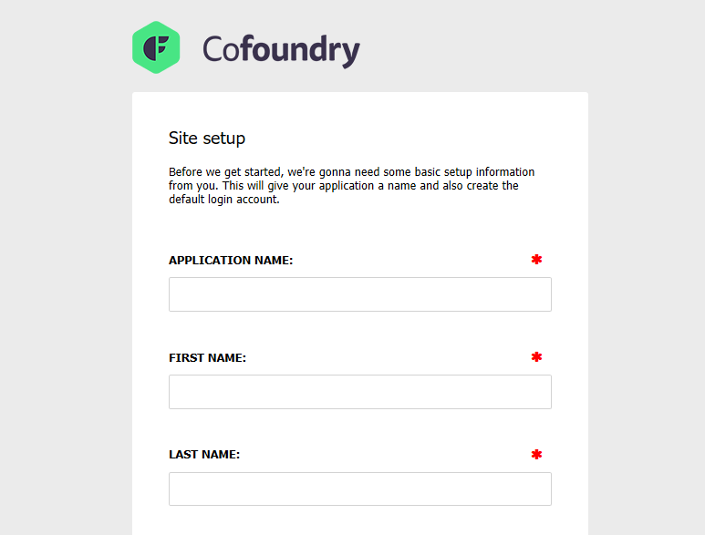

## Requirements

- .NET 8
- SqlServer (Express) 2016 or later, or Azure SQL

## Creating a new project using the .NET CLI

The simplest way to get started with Cofoundry is to create a web project using the `dotnet new` command line tool. This will create a basic website outline with some default plugins, startup code and example page templates, block types, custom entities and error pages.


#### Installation steps

1. Install the Cofoundry template package:

> dotnet new -i "Cofoundry.Templates::*"

2. Create a new project using the *cofoundry-web* template:

> dotnet new cofoundry-web -n ExampleApp

3. Create a new SQL Server database and amend the `Cofoundry:Database:ConnectionString` setting in your `appsettings.json` file to point to your new database.

4. Start the application and you will be greeted with the setup screen, use this to register an administrator account.



Congratulations, you've installed Cofoundry! Skip to the [Next Steps](#next-steps) section below for more information on what to do next. 

## Creating a new project manually

This is just an example of how you'd typically create a new site, but you can quite easily add Cofoundry to an existing site. Cofoundry database objects are namespaced under their own schema so there shouldn't be any issue with installing to an existing database.

### Creating the site

1. Open Visual Studio 2022 and select **Create a new project**

2. Select the "ASP.NET Core Web App (Model-View-Controller)" template and press **Next**

3. Fill in the project name, select a location and press **Next**

4. Ensure ".NET 8.0 (Long-term support)" is selected as the framework and "None" is selected as the authentication type, then press *Create*

5. Create an empty database in SQL Server.

6. Install the [Cofoundry.Web.Admin](https://www.nuget.org/packages/Cofoundry.Web.Admin/) NuGet package

### Configuring the site

The NuGet installation is intended to be unobtrusive to avoid causing conflicts with your existing configuration and settings, however, there are a few manual changes you'll need to make to your application to get up and running. 

1. Open your *appsettings.json* and add a connection string named 'Cofoundry' that points to the database you just created

```js
{
  "Cofoundry": {

    "Database": {
      "ConnectionString": "Server=.\\sqlexpress;Database=MyCofoundrySite;Integrated Security=True;Encrypt=False;MultipleActiveResultSets=True"
    }
  }
}
```

2. Amend your Program.cs file to bootstrap Cofoundry:

Note that exception handling, static file handling and routing is initialized by Cofoundry so we can remove these parts from the program file.

```csharp
using Cofoundry.Web;

var builder = WebApplication.CreateBuilder(args);

builder.Services
    .AddMvc()
    .AddCofoundry(builder.Configuration);

var app = builder.Build();

app.UseHttpsRedirection();
app.UseCofoundry();

app.Run();
```

3. Ensure your Cofoundry project is compatible with view pre-compilation by setting `MvcRazorExcludeViewFilesFromPublish` and `MvcRazorExcludeRefAssembliesFromPublish` to false in your .csproj project file (see [deployment documentation](publishing-and-deployment) for reasons why):

```xml
<Project Sdk="Microsoft.NET.Sdk.Web">

  <PropertyGroup>
    <TargetFramework>net8.0</TargetFramework>
    <ImplicitUsings>enable</ImplicitUsings>
    <Nullable>enable</Nullable>
	<MvcRazorExcludeViewFilesFromPublish>false</MvcRazorExcludeViewFilesFromPublish>
	<MvcRazorExcludeRefAssembliesFromPublish>false</MvcRazorExcludeRefAssembliesFromPublish>
  </PropertyGroup>
  
  <!-- other nodes removed for clarity -->
  
</Project>
```

4. Start the application and you will be greeted with the setup screen, use this to register an administrator account.
 
Congratulations, you've installed Cofoundry! 

## Essential Plugins

Some features of Cofoundry require plugins to be installed in order to use them, this includes:

- **Images:** Image resizing isn't supported natively by .NET Core, and so a plugin is required if you want to use images. The `cofoundry-web` project template automatically installs the [Imaging.SkiaSharp](https://github.com/cofoundry-cms/Cofoundry.Plugins.Imaging.SkiaSharp) plugin for you. For more information see the [images documentation](/content-management/images). 
- **Background Tasks:** Cofoundry currently does not have a built-in background task runner, so you need to install a plugin if you want to use this feature. For more information see the [background tasks documentation](/framework/background-tasks).
- **Email:** Notifications such as those from the admin panel require a mail host. You will need to install a plugin and configure your 3rd party mail host to send emails. See the [mail documentation](/framework/mail) for more information.

## Next steps

Now that you've got Cofoundry up and running, you might want to start by creating some [pages](/content-management/pages) or defining some [custom entities](/content-management/custom-Entities).

If you're interested in mixing in standard ASP.NET controllers and views then you can do that to, but you might want to read up on [Cofoundry routing](/content-management/routing).  
