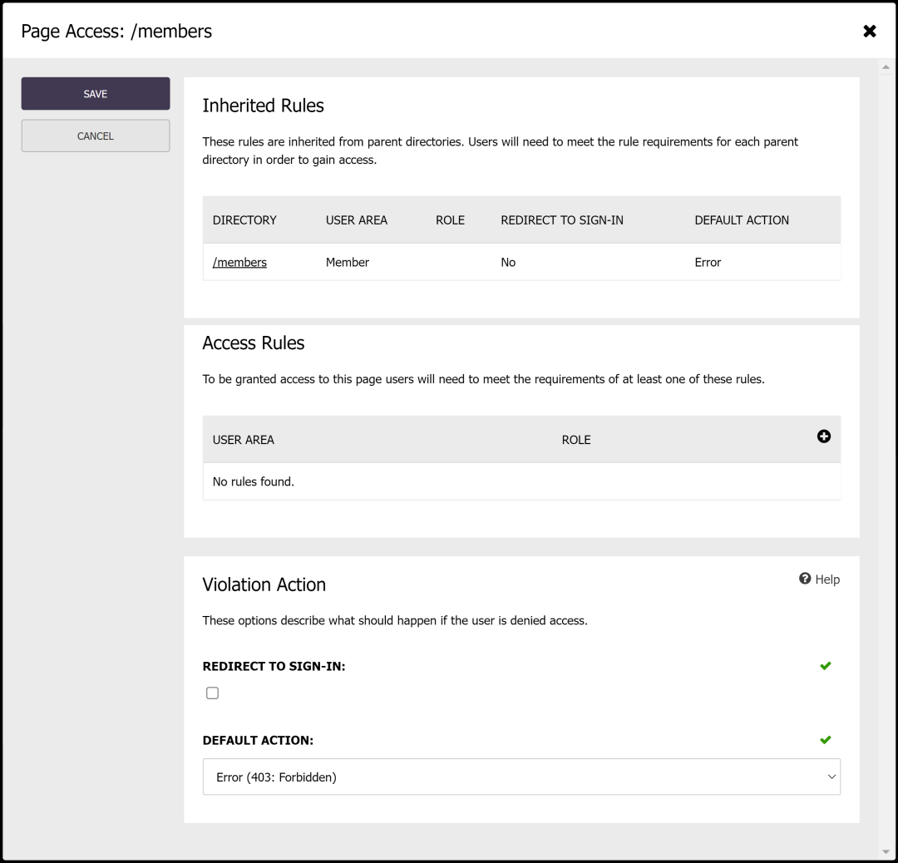

## Roles & Permissions

Custom user areas are covered by the same roles and permission system used broadly across Cofoundry, which controls raw access to various actions on entities such as being able to read pages, update settings and delete image assets. You'll need to set up the roles associated with your user area to ensure they have the relevant permissions to match your requirements.

For more information on configuring roles and restricting access in code, take a look at the [roles and permissions documentation](/framework/roles-and-permissions).

## Restricting Access to CMS Pages and Directories

Access to CMS pages and directories can be configured in the Admin Panel by clicking on the **Access Control** button on an individual page or directory screen. It's possible for rule configuration to get complicated, but typically you'd only ever have a single rule set on a parent directory or individual page.

In the example screen below there is a single rule applied to the parent directory of the page which restricts access only to users in the "Member" user area. If the user is not signed into the member user area then the user is redirected to the member sign in page.
 

Let's cover those options in more depth:

### Access Rules

The individual page and each parent directory in the hierarchy can have one or more access rules that determine who can access the resource. Rules on an individual resource are evaluated using an **OR** condition i.e. if an individual resource defines two rules for the "Regular" and "Pro" roles, then access will be granted to users who are in either the "Regular" or "Pro" roles.

Rules are inherited from parent directories and users must meet the criteria of each parent directory **AND** the page in order to be granted access. An example could be that a parent directory requires that the user is in the "Member" user area, and a sub-directory is further restricted to only the "Pro" role.

### Violation Actions

When access is denied, the "violation action" associated with the broken rules is invoked. Options include:

- **Redirect to Sign In:** If selected, then if the user is not signed in they will be redirected to the sign in page associated with the user area specified in the rules.
- **Default Action:** The default action applies if "Redirect to Sign In" is not selected, or if the user is signed in but does not meet the rule criteria i.e. correct user area, but incorrect role. Options include "Error", which returns a 403 error result, or "Not Found" which returns a 404 result.

