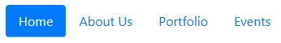
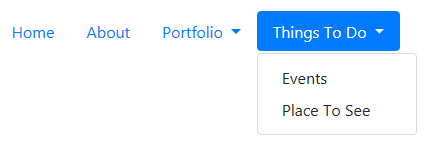
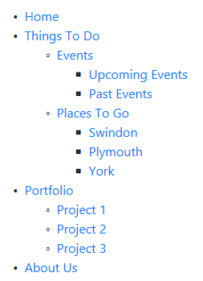

# Menus Sample

A bare website showing various examples of creating content editable menus.

#### To get started:

1. Start up the local-env docker compose file to get the database running. See [local-env docs](../../local-env/README.md) for details.
2. Run the website and navigate to *"/admin"*, which will display the setup screen
3. Enter an application name and setup your user account. Submit the form to complete the site setup. 
4. You can then sign in and configure data in the admin panel or navigate to the hompage to see the manu output.
 
## Menu Types

Each menu type is created using [Custom Entities](https://www.cofoundry.org/docs/content-management/custom-entities) to store the data and asp.net [View Components](https://docs.microsoft.com/en-us/aspnet/core/mvc/views/view-components) to render the data.

### Simple Menu

The simple menu demonstrates how you can build a content manageable list of pages using the `[PageCollection]` attribute.

### Nested Menu

The nested menu demonstrates how you can build menus with a pre-defined number of menu levels. This is achieved using [nested data models](https://www.cofoundry.org/docs/content-management/data-model-annotations/nested-data-models) and the `[NestedDataModelCollection]` attribute.

This example only contains one nested menu level, but you could define more by creating and nested more menu types. To use an indeterminate number of menu levels (i.e. a tree structure) have a look at the multi-level menu example.

### Multi-level Menu

The multi-level menu example demonstrates how to create a menu with an unlimited number of menu levels (i.e a tree structure) using a recursive data model definition.
