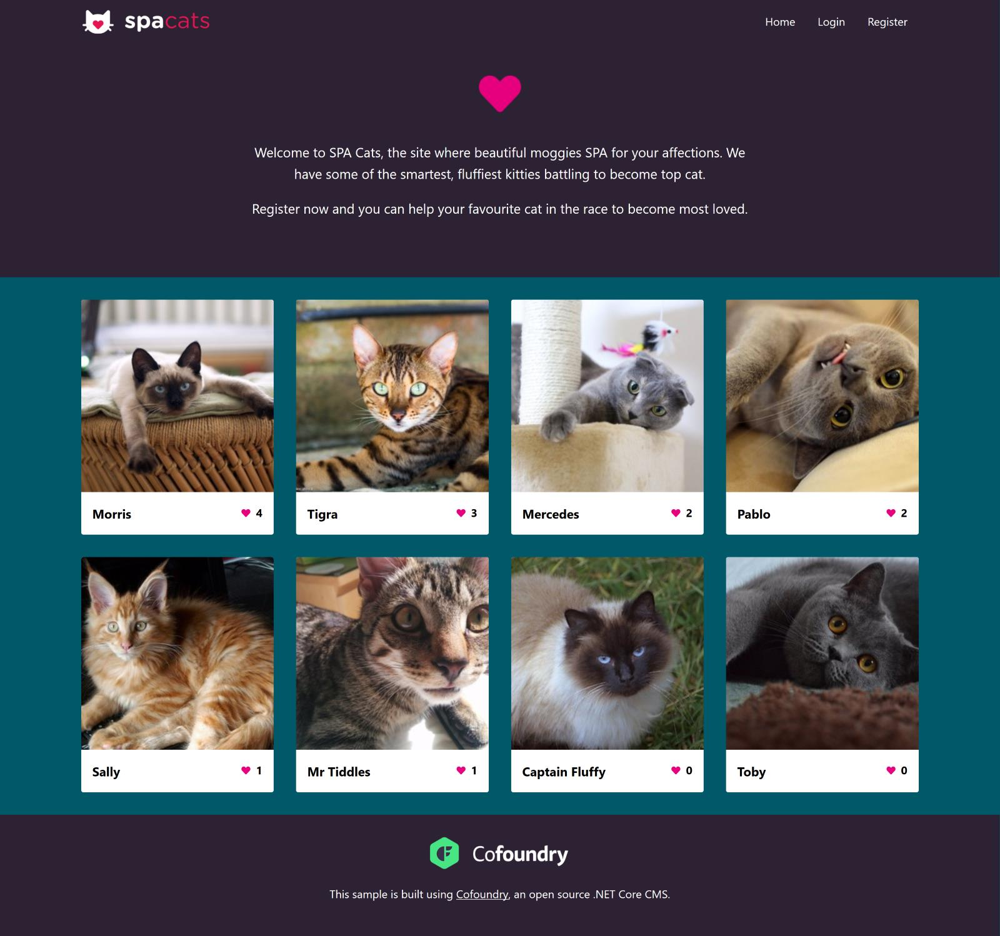
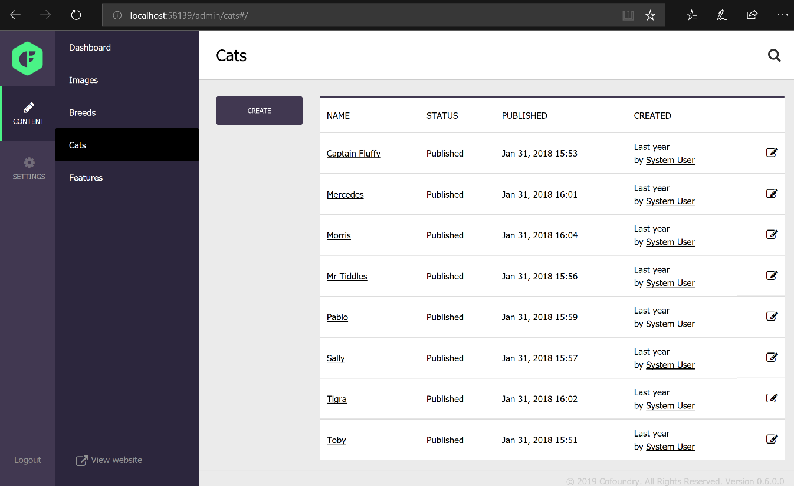
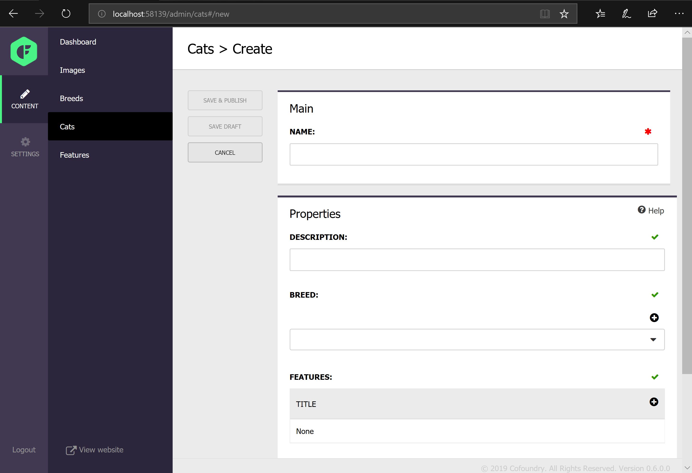
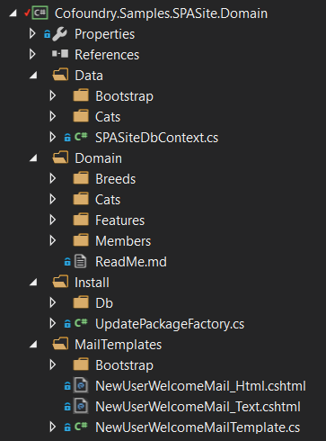
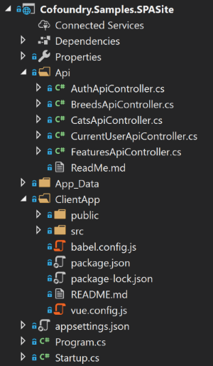

# SPASite Sample

This sample shows how to use Cofoundry to create a SPA (Single Page Application) with WebApi endpoints as well as demonstrating some advanced Cofoundry features. The application is also separated into two projects demonstrating an example of how you might structure your domain layer to keep this separate from your web layer.

This sample uses Vue.js as the SPA framework, but this is easily swapped out for another SPA framework as all interactions are made over a REST API.

Notable features include:

- Startup registration
- Web Api, use of `IApiResponseHelper` and managing command validation errors in a SPA
- Structuring commands and queries using CQS 
- Multiple related custom entities - Cats, Breeds and Features
- A member area with a sign-up and login process
- Using an Entity Framework DbContext to represent custom database tables
- Executing stored procedures using `IEntityFrameworkSqlExecutor`
- Integrating custom entity data with Entity Framework data access
- Using the auto-updater to run SQL scripts
- Email notifications & email templating
- Registering services with the DI container

#### To get started:

1. Start up the local-env docker compose file to get the database running. See [local-env docs](../../local-env/README.md) for details.
2. Run the website and navigate to *"/admin"*, which will display the setup screen
3. Enter an application name and setup your user account. Submit the form to complete the site setup. 
4. The sample database is pre-seeded with site data, so you can either browse the site or sign in and customize data.

## App Overview

*SPA Cats* is a simple site that lets you browse and rate cats. Cat data can be entered into the Cofoundry CMS admin panel, which is then displayed on the homepage. Users can browse the data, register as a member and vote for their favorite cat.

### Managing Content

To manage content you'll need to log in to the admin panel by navigating to **/admin**.

#### Adding New Cats

Once logged in, navigate to **Content > Cats**. This section is generated automatically based on the [`CatCustomEntityDefinition`](https://github.com/cofoundry-cms/Cofoundry.Samples/tree/main/src/SPASite/SPASite.Domain/Domain/Cats/Definition/CatCustomEntityDefinition.cs) class in the Domain project. Click on the **Create** button to add a new Cat.

The data entry form is generated based on the [`CatDataModel`](https://github.com/cofoundry-cms/Cofoundry.Samples/tree/main/src/SPASite/SPASite.Domain/Domain/Cats/Definition/CatDataModel.cs), a simple class with annotated properties. The Cat custom entity type has versioning enabled, so we can either save the new cat as a draft version or make it live by publishing it.

The two other custom entities *Breeds* and *Features* can be managed in the same way.

### Code

In this example we demonstrate separating your application into two projects to represent two distinct layers. For a simpler example which keeps all files in one project see the [SimpleSite sample project](https://github.com/cofoundry-cms/Cofoundry.Samples/tree/main/src/SimpleSite).

#### SpaSite.Domain

Contains domain logic and data access.

-  **Data:** We use some custom SQL tables to store cat popularity data. An Entity Framework DbContext is used to access the custom tables.
- **Domain:** The domain contains all the models, [queries and commands](https://www.cofoundry.org/docs/framework/data-access/cqs) that we use to retrieve and store data. It also contains the [Custom Entity Definitions](https://www.cofoundry.org/docs/content-management/custom-entities) that define the *Breed*, *Cat* and *Features* custom entities, and the [User Area Definition](https://www.cofoundry.org/docs/user-areas) that defines the *Members* login area. Structuring our code in this way gives us a clean separation between our domain logic layer and our application layer.
- **Install:** Here we take advantage of the [Auto Update](https://www.cofoundry.org/docs/framework/auto-update) feature in Cofoundry to run SQL scripts that create our custom tables and stored procedures.
- **MailTemplates:** We store our [mail templates](https://www.cofoundry.org/docs/framework/mail) in the domain layer so they can be used from inside our commands. Because we are including the template cshtml files as embedded resources here, we need to include an `AssemblyResourceRegistration` which is located in the bootstrap folder. 

#### SpaSite

Because all our logic is in the domain layer, our website project is fairly simple.

- **Api:** Contains our web api controllers. These are quite lightweight and mostly just wrap our domain queries and commands.
- **App_Data:** This folder contains any asset files uploaded to the CMS.
- **ClientApp:** SPA Cats is written in [Vue.js](https://vuejs.org/), but you could use any framework you like. The ClientApp folder contains all the Vue.js front-end code and build files.
- **Program.cs:** [Cofoundry startup and registration](https://www.cofoundry.org/docs/framework/website-startup) is handled via the standard .NET Core Program.cs file in the application root. There's some additional code here to bootstrap the Vue project using the [VueCliMiddleware](https://github.com/EEParker/aspnetcore-vueclimiddleware) NuGet package.
